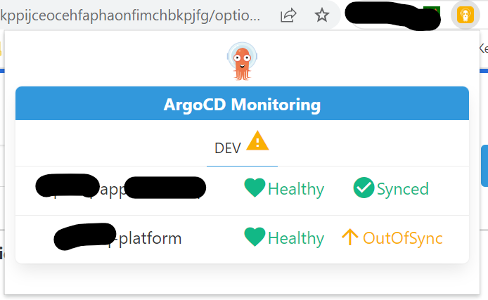

# Argo CD - Chrome Extension

Initially made
using [Chrome Extension Boilerplate with React 17 and Webpack 5](https://github.com/lxieyang/chrome-extension-boilerplate-react)

> Note: 
> 
> While I use this extension every day, I still consider it a "toy" project since it's a first time
> creating a chrome extension and a first webpack/react project.

## Features

This extension let's you monitor your ArgoCD applications:

- By showing applications status (Health and Sync)
- By notifying on status change
- Show the status directly on the browser (if the extension is pinned)

For this it only a required an Argo CD access token with read-only rights to applications.

More information:
- On ArgoCD API Docs: https://argo-cd.readthedocs.io/en/stable/developer-guide/api-docs/
- On Argo CD [User Management](https://argo-cd.readthedocs.io/en/stable/operator-manual/user-management/#local-usersaccounts-v15) and [RBAC Rules](https://argo-cd.readthedocs.io/en/stable/operator-manual/rbac/)

## Screenshots




## Installing and Running

### Building:

1. Check if your [Node.js](https://nodejs.org/) version is >= **16**.
2. Clone this repository.
5. Run `npm install` to install the dependencies.
6. Run `npm start`
7. Load your extension on Chrome following:
    1. Access `chrome://extensions/`
    2. Check `Developer mode`
    3. Click on `Load unpacked extension`
    4. Select the `build` folder.
8. Happy hacking.

## Packing

After the development of your extension run the command

```
$ NODE_ENV=production npm run build
```

Now, the content of `build` folder will be the extension ready to be submitted to the Chrome Web Store. Just take a look
at the [official guide](https://developer.chrome.com/webstore/publish) to more infos about publishing.

## Secrets

If you are developing an extension that talks with some API you probably are using different keys for testing and
production. Is a good practice you not commit your secret keys and expose to anyone that have access to the repository.

To this task this boilerplate import the file `./secrets.<THE-NODE_ENV>.js` on your modules through the module named
as `secrets`, so you can do things like this:

_./secrets.development.js_

```js
export default {key: '123'};
```

_./src/popup.js_

```js
import secrets from 'secrets';

ApiCall({key: secrets.key});
```

:point_right: The files with name `secrets.*.js` already are ignored on the repository.

## Resources:

- [Webpack documentation](https://webpack.js.org/concepts/)
- [Chrome Extension documentation](https://developer.chrome.com/extensions/getstarted)
